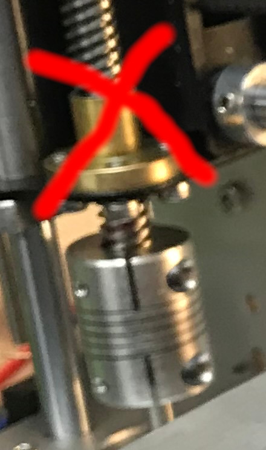
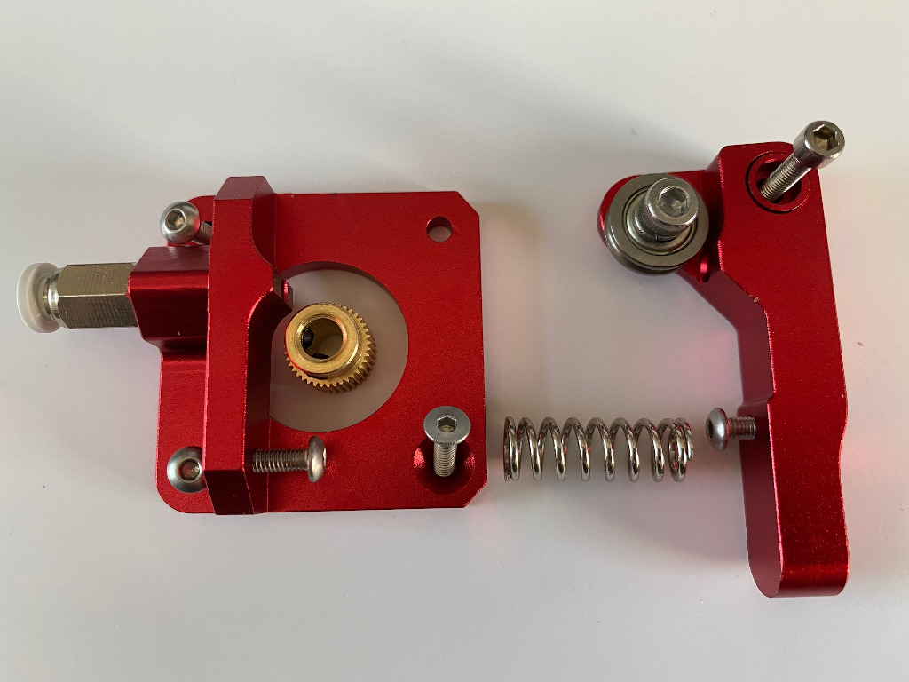
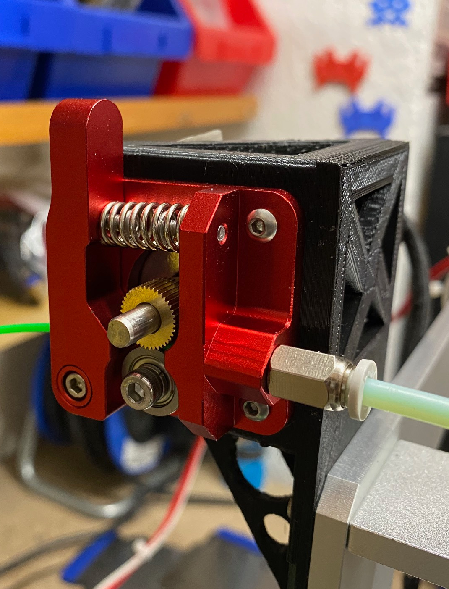

# Geeetech I3 Pro Alu (2018)


Some notes on my [Geeetech I3 Pro Alu 3D-Printer](https://www.geeetech.com/wiki/index.php/Prusa_I3_A_pro_3D_Printer) as well as a
pre-configured Marlin firmware and a [simple dockerized firmware builder](firmware/README.md).

<!-- vim-markdown-toc GFM -->

* [Assembly](#assembly)
* [Send Gcode to the printer](#send-gcode-to-the-printer)
    * [PID tuning](#pid-tuning)
* [Custom Marlin Firmware](#custom-marlin-firmware)
* [Modifications](#modifications)
    * [Nozzle cooler (for original MK8 extruder)](#nozzle-cooler-for-original-mk8-extruder)
    * [Z-axis anti wobble](#z-axis-anti-wobble)
    * [Base clamps](#base-clamps)
    * [E3Dv6 and bowden extruder upgrade](#e3dv6-and-bowden-extruder-upgrade)
        * [Extruder assembly](#extruder-assembly)
        * [Extruder mount](#extruder-mount)
        * [Mount for E3Dv6 and new X-Carriage](#mount-for-e3dv6-and-new-x-carriage)
        * [Nozzle cooling fan](#nozzle-cooling-fan)
* [Evolution of calibration cubes](#evolution-of-calibration-cubes)
* [What's next?](#whats-next)
* [Useful links](#useful-links)
* [Author](#author)
* [License](#license)

<!-- vim-markdown-toc -->

## Assembly


* some parts where not manfuctured very accurate (e.g. the holes in the x-axis
  idle ends), so I had to use a rasp to make the smooth rods fit.
* I had problems with the Z-axis (Z-axis often got stuck) until I mounted the
  Z-Axis nuts as shown here:

  
  

## Send Gcode to the printer

Use a terminal like e.g. `picocom` to send gcode commands directly to the printer:

```sh
$  picocom --imap lfcrlf -c -b 250000 /dev/ttyUSB0
G28<ENTER>
```
End picocom with `CTRL+A` `CTRL+Q`.

Alternatively run `make terminal` if using the [firmware builder](firmware/README.md).

### PID tuning

TODO

## Custom Marlin Firmware

The printer is controlled by the so-called "3-in-one" printer box, which hosts a
[GT2560](http://www.geeetech.com/wiki/index.php/GT2560).

I updated the firmware to [marlin](https://marlinfw.org/) v1.1.9 with [manual bed levelling](https://marlinfw.org/docs/gcode/G029-mbl.html) enabled.


The [firmware](firmware) directory contains my marlin configurations as well as
infos on how to use my self-contained dockerized firmware builder.

## Modifications

Log of the modifications I did over the time, in chronological order.


### Nozzle cooler (for original MK8 extruder)

After getting the printer up and running, this was the first upgrade I printed,
which improved overall printing quality. It's also possible to add a distance
sensor, which I obviously not yet have added. Since I use the [manual bed
levelling feature of Marlin](https://marlinfw.org/docs/gcode/G029-mbl.html),
levelling became very easy, so that an auto levelling sensor has no priority
for me at the moment.

* Model: https://www.thingiverse.com/thing:1540434


### Z-axis anti wobble

Printed, but not yet installed.

* Model: http://www.thingiverse.com/thing:1424358
* See it in action: https://www.youtube.com/watch?v=mYswkbC_AX0


### Base clamps

The base clamps stabilize the printer on the the board.

* Model: https://www.thingiverse.com/thing:1502838


### E3Dv6 and bowden extruder upgrade

In June 2020 I modified the 3d-printer to use a E3Dv6 hotend and a bowden
extruder.

#### Extruder assembly

I received my extruder from china without instructions. This is how I solved
the puzzle:




I also had to replace some of the screws, because they were too long.

* Useful video here: https://www.youtube.com/watch?v=AAe7k_X7kQg

#### Extruder mount

I used this mount to attach the bowden extruder to the aluminium frame of the
I3A Pro: https://www.thingiverse.com/thing:3513863




I attached the mount to the left side of the printer.

#### Mount for E3Dv6 and new X-Carriage

To mount the E3Dv6 I used this mount with integrated cooling:
  * https://www.thingiverse.com/thing:1632847
and this X-Carriage:
  * https://www.thingiverse.com/thing:2514659

The X-Carriage uses M3 screws while the E3Dv6 mount uses M4 screws, I ended
up enlarging the drill holes of the X-Carriage to M4 size. I also needed to extend the
Z-Axis end switch screw, which originally was to short for use with the new X-Carriage.


#### Nozzle cooling fan

The new fan and duct used (https://www.thingiverse.com/thing:1632847) are so
effective, that at 100% fan power, I always got "E1 Thermal runaway" errors.
By limiting the fan power to 50% everything was fine.

TODO connection

The fan can be tested using gcode commands:

* Turn nozzle fan (`P0`) off: `M106 P0 S0`
* Set nozzle fan to 50%: `M106 P0 S128`

## Evolution of calibration cubes

Testcubes printed in chronological order 1..6..10, A..C etc. Unfortunately I lost some of my
notes which documented the printer settings used :-( 


  * `1` - my first "successful" 3d-print


  * `A` - after switch to Marlin 1.1.9, 210° / 50°
  * `B` - 210° / 50° - last print with original MK8 hotend 
  * `C` - 210° / 50° - first print with E3Dv6 bowden setup. Significant improvements in the details
          and reduced ghosting.

## What's next?

  * auto bed levelling
  * install Z-axis anti-wobble
  * test different printing beds (e.g. glass)
  * test marlin 2.0 firmware

## Useful links

* Firmware official: http://www.geeetech.com/forum/viewtopic.php?f=10&t=17046
* i3a Pro community provided firmware: http://www.geeetech.com/forum/viewtopic.php?f=80&t=62050

## Author

(c) 2020 by Jan Delgado

## License

MIT
